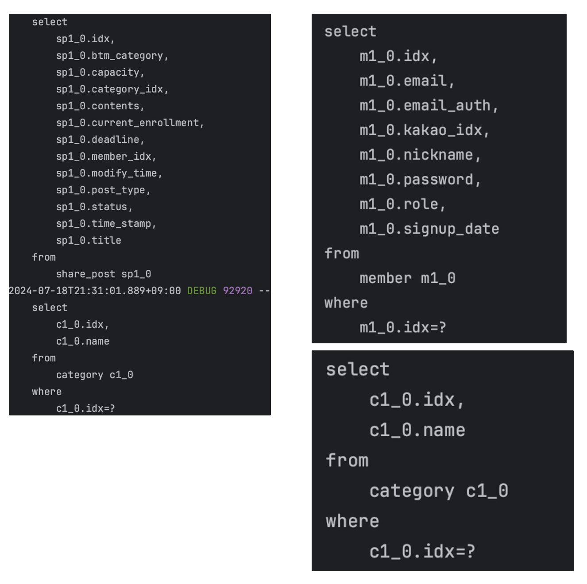
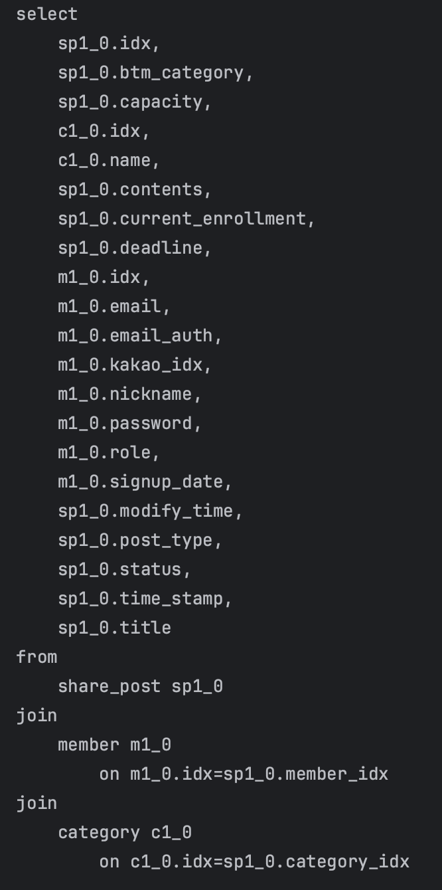
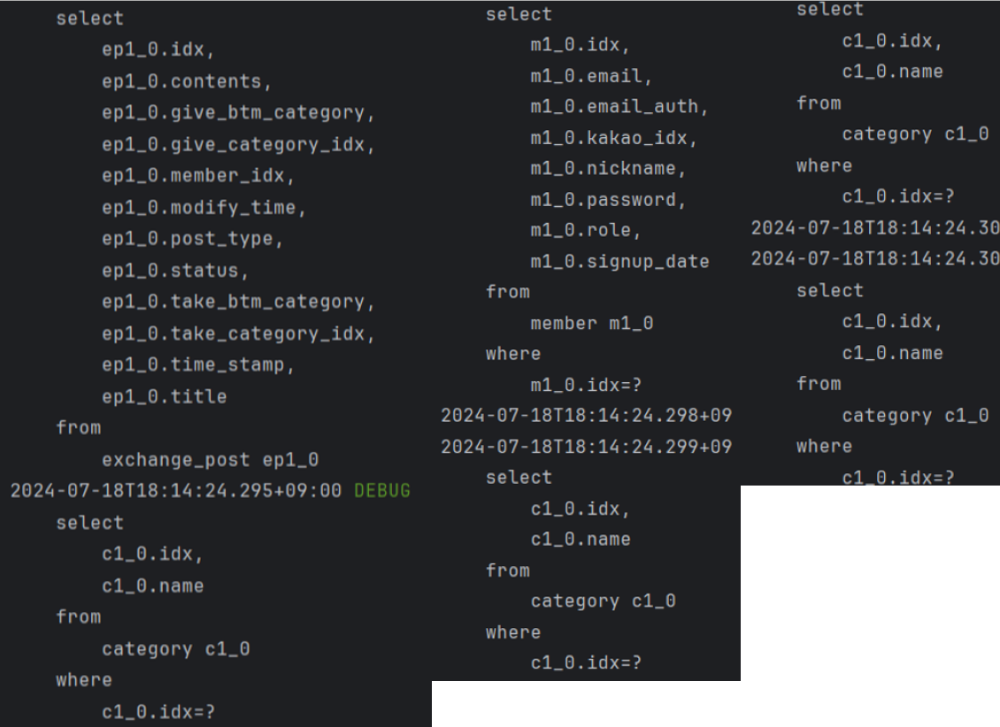
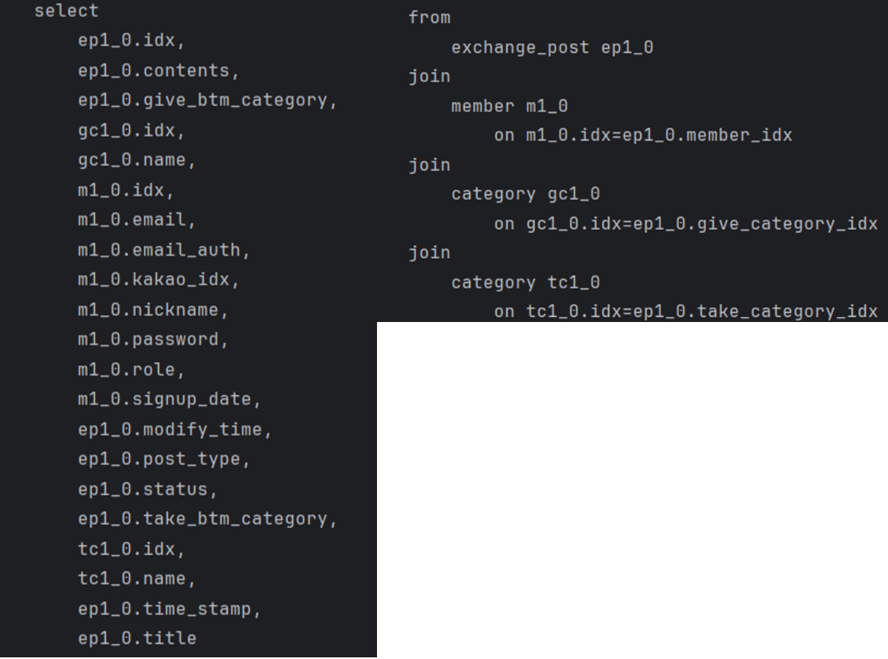
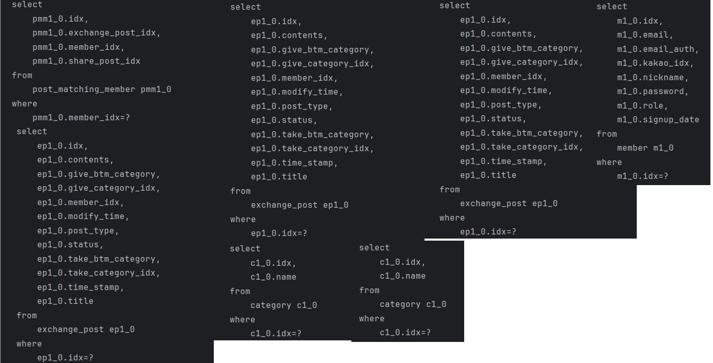
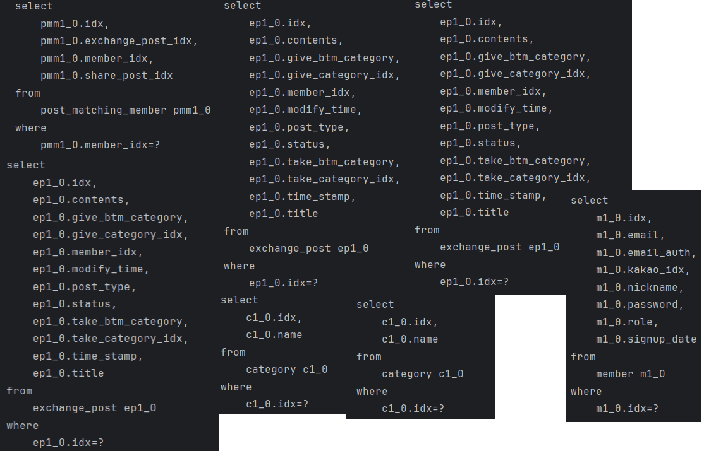
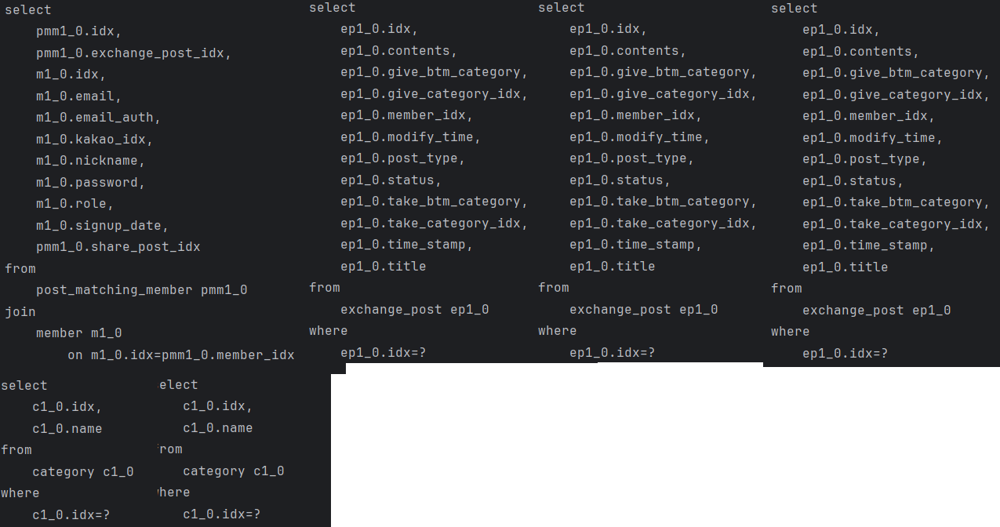
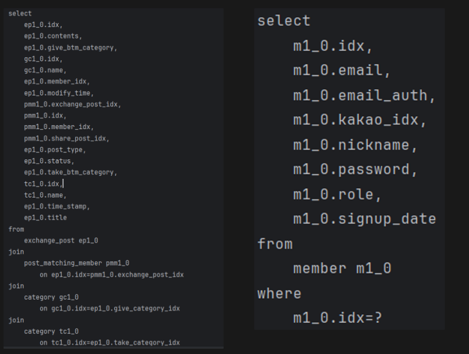
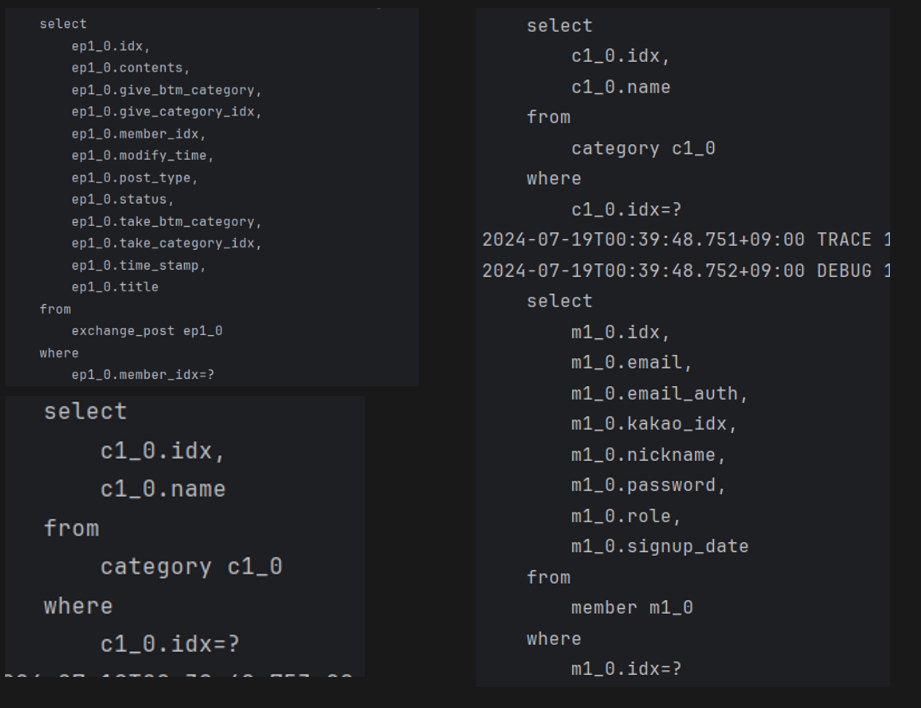
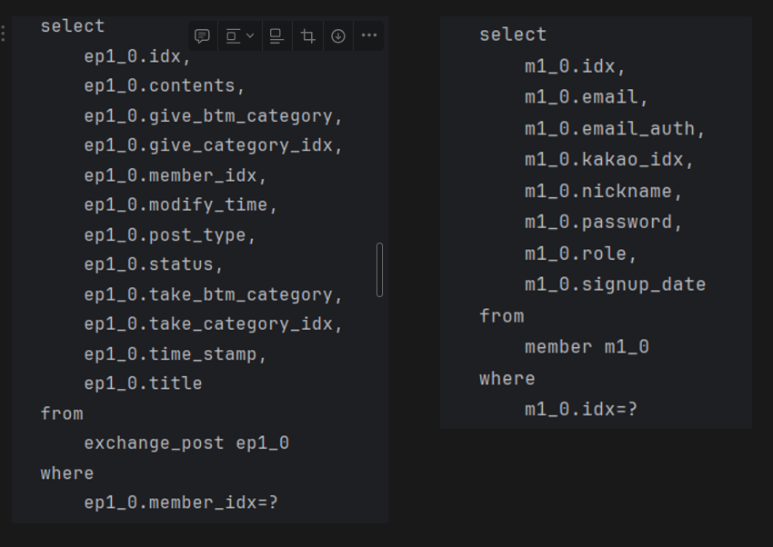

# be06-2nd-ketchop-mojal
<br><br>

<div align=center>
<h3>Mojal</h3>
<h4>👽한별, 🐹구은주, 🐨최정완, 🦊도지민, 🤖안준홍</h4>
</div>
<br>

<div align=center>
	<h2>📚 Tech Stack 📚</h2>
	<p>✨ Platforms & Languages ✨</p>
</div>
<div align="center">
	<!--
	
	
	
	
	-->
	<br>
	
        
	<!-- 
	
	
	-->
	<br>
	
	<!--
	
	
	-->
</div>
<br>
<div align=center>
	<h2>🛠 Tools 🛠</h2>
</div>
<div align=center>
	
	
	<!--
	
	
	-->
</div>
<br>
<br>
<!--
# 📌재능교환/나눔 서비스 기획서

## 1. 서비스 소개

모잘 서비스는 지식과 재능을 서로 공유하며 양방향으로 나아가 지식과 재능의 확장을 제공한다. 이는 다양한 사람들과의 교류를 통해 새로운 경험과 공유에 대한 가치를 일깨우고 동시에 자신의 재능을 어필하고 싶은 요구를 충족시켜주는 것이 목표이다. </br>
모잘 서비스는 크게 두 가지 기능을 제공한다. </br>
재능 교환 서비스는 물물교환 처럼 자신이 가진 재능과 상대방의 재능을 맞교환하는 방식의 서비스다. 채팅을 통한 협의 하에 교환 상대가 결정할 수 있으며 그들만의 방식으로 재능을 교환한다. 이를 통해 커뮤니케이션을 활성화하고 서로가 부족한 재능을 채워줄 수 있다.</br>
재능 나눔 서비스는 자신의 재능을 무료로 제공해 주는 서비스다. 이는 영리적 목적보다는 경험의 기회가 적은 현대 사회인들을 위해 경험을 쌓기 위한 기회를 제공하는데 중점을 둔다. 교육 경험을 쌓고 싶은 사람, 교육장 오픈 전 교육 실력을 향상하거나 초기 회원을 모으고싶은 사람 등이 주 타켓층으로, 제공하고싶은 재능을 선착순으로 제한된 인원에게만 무료로 제공해주는 서비스다.

## 2. 서비스 목표

- **다양한 커뮤니케이션 활성화** : <br>   본인이 가지고 있는 재능을 교환하면서 여러사람과 커뮤니케이션을 활성화시켜 양방향 소통이 활발해질 수 있도록 기여함.
- **본인의 역량을 발휘할 수 있는 경험 제공** : <br> 다양한 경험을 쌓고싶은 현대사회인에게 쉽게 접근할 수 있는 기회를 제공.
- **재능을 나눔으로써 공유의 장 생성** : <br>  자신의 재능을 경험의 기회가 적은 사람에게 제공하고 다른 경험을 제공받음으로써 공유의 가치를 확장.
- **교육의 진입 장벽 낮춤** : <br> 전문가들만 교육 할 수 있었던 기존 체계에서 무경력 일반인들에게도 기회 제공.


## 3. 서비스 차별화 전략

- **재능 교환** : <br> 상업적 목적이 아닌 '재능 교환'이라는 비영리성 목표를 둔다.
- **타임어택 기능** : <br> 게시물 마감 시간을 두어 이벤트성 기분을 느끼게하여 재미를 제공한다.

## 4. 서비스 배경


2023년도 기사에 따르면 숨고, 크몽과 같은 재능마켓 앱의 설치 건수가 4년 사이에 약 8배정도 폭증하였다고 한다. 특히 숨고는 2019년 이용자가 5만명이었는데 4년간 연평균 이용자가 5배나 늘어난 25만명을 기록하였다. <br>
IT 업계에선 재능 마켓 앱을 통해 거래되는 재능 가운데 번역이나 문서 작업 등 사무직 업무 혹은 이미지 생성 등 예술을 비롯한 지적 서비스는 챗GPT를 위시한 생성 AI가 끊임없이 발전하면서 대체될 가능성이 있다는 예측이 나오고 있다. 해당 예측에 따라서 인간이 물리적으로 할 수 있는 활동만 인기를 유지할 수 있을 것이란 분석이다. <br>
이를 토대로 “재능 플랫폼에선 AI가 못 하는 오프라인 재능의 수요가 높아질 것” 이라고 하였다. <br>
이러한 기사를 찾아보며 재능마켓, 재능공유 플랫폼이 수요가 있다고 생각하였으며 성장 가능성 또한 높다고 판단하였다. <br>

하지만, 현 시장에 성황 중인 재능플랫폼들의 문제점도 지적되고있다. <br>
시장조사전문기업 엠브레인 모니터는 전국 만 19~59세 성인남녀 1000명을 대상으로 ‘재능공유 플랫폼’ 관련 인식 조사를 실시 한 결과, 개선이 필요한 몇몇 부분이 지적되었다. <br>
첫째, “경력  강사에게 투자한 가격에 비해, 강의 콘텐츠의 품질이 떨어질 수 있을 것 같다”(71.2%)는 우려 섞인 시선이 나타나 향후 콘텐츠의 전문성과 신뢰도를 보완할 필요가 있음을 알 수 있었다. <br>
둘째, 재능 판매를 원하는 일반인 A씨는 대표적인 재능 플랫폼 ”크몽” 고객센터에서 경력이 없으면 서비스를 등록하는 게 힘들다는 답변을 들었다. <br>

이러한 불편함을 토대로 아래와 같은 개선점을 “모잘” 서비스에 적용하였다.
1. 무경력 일반인들도 서로 재능을 교환할 수 있고, 나눔할 수 있다.
2. 무경력 일반인들도 판매자는 교육의 경력을 쌓을 수 있는 기회, 구매자는 무료로 교육을 받을 수 있는 기회로 차별화를 두었다.
-->
<!--
## 5. 재난 복구 계획 시나리오
ketchop팀에서는 서비스의 연속성이 있고 데이터 유실이 거의 없는, 즉시 복구되는 Mirror(active/active) 재해복구 방법을 선택하였다. <br>
한 쪽 서버가 다운되었을 시, 재난복구과정은 다음과 같다.

1. 실시간 데이터 복제 설정 <br>
    - 데이터베이스 복제 소프트웨어 설치 및 설정 <br>
    - 주 DB 서버와 미러 DB 서버 간의 데이터 동기화 주기 설정 (예: 1분 간격) <br>

2. 모니터링 및 장애 감지 <br>
    - DB 서버 상태 모니터링 도구 (예: Nagios, Zabbix) 설치 <br>
    - 장애 발생 시 알림 설정 (SMS, 이메일, 대시보드) <br>

3. 실시간 데이터 복제 설정 <br>
    - 장애 발생 시 자동으로 미러 DB 서버로 트래픽 전환 설정 (로드 밸런서, 자동화 스크립트 활용) <br>
    - 수동 전환 절차도 병행 준비 <br>

4. 실시간 데이터 복제 설정 <br>
    - 장애 발생 시 즉시 미러 사이트로 전환 <br>
    - 복구 팀은 주 DB 서버의 장애 원인 파악 및 문제 해결 <br>

5. 실시간 데이터 복제 설정 <br>
    - 주 DB 서버 복구 및 테스트 완료 후, 미러 DB 서버와 동기화 <br>
    - 데이터 완전 동기화 후 서비스 다시 주 DB 서버로 전환 <br>
<br>
-->
<!--
# 📚기능/요구사항/테스트 명세서
<summary> <h3>1. 기능 명세서</h3> </summary>
<p></p>

<summary> <h3>2. 요구사항 정의서</h3> </summary>
-->

<br>

# 🐸ERD
<br><br>
---

# 🐳시스템 아키텍처
<a href="https://github.com/beyond-sw-camp/be06-2nd-ketchop-mojal/wiki/%EC%8B%9C%EC%8A%A4%ED%85%9C-%EC%95%84%ED%82%A4%ED%85%8D%EC%B3%90">시스템 아키텍쳐</a><br><br>

# 소프트웨어 아키텍처
<a href="https://github.com/beyond-sw-camp/be06-2nd-ketchop-mojal/wiki/%EC%86%8C%ED%94%84%ED%8A%B8-%EC%95%84%ED%82%A4%ED%85%8D%EC%B3%90">소프트웨어 아키텍쳐</a><br><br>
# 시퀀스 다이어그램
<a href="https://github.com/beyond-sw-camp/be06-2nd-ketchop-mojal/wiki/%EC%8B%9C%ED%80%80%EC%8A%A4-%EB%8B%A4%EC%9D%B4%EC%96%B4%EA%B7%B8%EB%9E%A8">시퀀스 다이어그램</a><br><br>

<!--
# 💻SQL개발
<details>
	<summary> <b>DDL </b> </summary>
	<p>
		<br>
		<br>
		<br>
		<br>
		<br>
		<br>
		<br>
	</p>
</details>

<details>
	<summary><b>1. USER회원가입 </b></summary>
	<p>
		- nickname,email,password,signup_date,user_auth의 값을 입력하고 회원가입을 한다.<br>
		
	</p>
</details>


<details>
	<summary> <b>2. USER정보조회 </b> </summary>
	<p>
		- USER정보(전체조회)
		- select all로 USER테이블에서 전체유저정보를 조회한다.<br>
		
	
		- USER정보(특정유저정보조회)
	    	- select all로 USER테이블에서 where절에서 해당 조건으로 특정유저정보를 조회한다.
      		<br>
		
	</p>
</details>


<details>
	<summary> <b>3. CHAT-ROOM생성 </b> </summary>
	<p>
		- idx=5인 post에서 idx=1인 user가 채팅하기를 클릭했을 때<br>
		1. 생성 조건 확인<br>
		   <br>
		2. 이미 참여중인 채팅방이 있는지 확인<br>
		   <br>
		3. 게시글 작성자 확인<br>
		   <br>
		4. chat_room 생성<br>
		   <br>
	</p>
</details>


<details>
	<summary> <b>4.CHAT_ROOM리스트 조회 </b></summary>
	<p>
		- 참여중인 채팅방 조회(user idx=1)<br>
		<br><br>
		- 내가 작성자인 게시글의 채팅방 조회(user idx=1)<br>
		<br><br>
		- 내가 신청자인 게시글의 채팅방 조회(user idx=1)<br>
		<br><br>
	</p>
</details>


<details>
	<summary> <b>5. CHAT_MESSAGE생성 </b> </summary>
	<p>
		- chattime, message, send_user_idx, CHAT_ROOM_idx를 insert해서 CHAT_MESSAGE를 생성한다.<br>
		
	</p>
</details>


<details>
	<summary> <b>6. POST작성 </b> </summary>
	<p>
		- title, c_top_give,c_top_want,c_btm_give,c_bottom_want,contents, post_time, modify_time,status, post_type,USER_idx 를 입력하고 POST작성을 한다.
		<br>
		
	</p>
</details>


<details>
	<summary> <b>7. 글 상세 조회 </b> </summary>
	<p>
		- title, c_top_give,c_top_want,c_btm_give,c_bottom_want,contents, post_time, modify_time,status, post_type,USER_idx를 POST테이블에서 where절에서 해당조건으로 조회한다.<br>
		
	</p>
</details>


<details>
	<summary> <b>8. 글 목록 조회 </b> </summary>
	<p>
		- 전체 글 목록 조회<br>
		<br><br>
		- 나눔 글 목록 조회<br>
		<br><br>
		- 교환 글 목록 조회.<br>
		<br><br>
	</p>
</details>

 
<details>
	<summary> <b>9. USER가 작성한 글 조회 </b> </summary>
	<p>
		- title, c_top_give,c_top_want,c_btm_give,c_bottom_want,contents, post_time, modify_time,status, post_type,USER_idx를 POST테이블에서 where절에서 해당조건으로 USER가 작성한 글을 조회한다.
		  <br>
		
	</p>
</details>


<details>
	<summary> <b>10. USER가 신청한 글 조회 </b> </summary>
	<p>
		- POST_MATCHING_USER 테이블을 참조하여 해당 테이블 안에 있는 해당 USER_IDX를 찾고, 해당 USER의 POST_ID를 찾아 해당 POST의 ID에 맞는 글을 조회한다.
		  <br>
		
	</p>
</details>


<details>
	<summary> <b>11. 검색 </b> </summary>
	<p>
		- 카테고리 검색(idx=1 인 카테고리 선택)<br>
		<br><br>
		- 키워드 검색(키워드 : "software")<br>
		<br><br>
		<br><br>
	</p>
</details>

<details>
	<summary> <b>12. 교환상대확정 </b> </summary>
	<p>
	- 게시글 상태 변경 후 교환 상대 저장<br>
  	
	</p>
</details><br><br>
-->

# 성능개선 - (N+1문제해결)
 
<details>
<summary> <b> 나눔글 전체조회 </b> </summary><br>
	
### 나눔글 전체조회
```java
public List<SharePostListRes> authorList(Long loginUserIdx) {
    Member member = Member.builder()
            .idx(loginUserIdx)
            .build();
    //쿼리 발생
    List<SharePost> posts = sharePostRepository.findAllByMember(member);

    List<SharePostListRes> sharePostListRes = new ArrayList<>();
    for (SharePost post : posts) {
        sharePostListRes.add(SharePostListRes.builder()
                //쿼리 발생
                .writerIdx(post.getMember().getIdx())
                .title(post.getTitle())
                .timeStamp(post.getTimeStamp())
                .status(post.getStatus())
                .postType(post.getPostType())
                .deadline(post.getDeadline())
                .capacity(post.getCapacity())
                .currentEnrollment(post.getCurrentEnrollment())
                //쿼리 발생
                .category(post.getCategory().getName())
                .btmCategory(post.getBtmCategory())
                .build());
    }
    return sharePostListRes;
}
```
<br>

### Before
#### 메서드 실행 시간
`ResponseEntity com.example.mojal2ndproject2.sharePost.SharePostController.list(CustomUserDetails) - 시간 - 73ms` 
#### 쿼리 발생 횟수
나눔글 전체조회 시 3번의 쿼리가 발생한다.
<br>
### 성능개선 1. 테이블을 JOIN FETCH해서 조회
```java
// JOIN FETCH 사용 전
        List<SharePost> posts = sharePostRepository.findAllByMember(member);
```
```java
// JOIN FETCH 사용 
        List<SharePost> posts = sharePostRepository.findAllByMemberWithMemberAndCategory(member);
```
#### 메서드 실행 시간
`ResponseEntity com.example.mojal2ndproject2.sharePost.SharePostController.list(CustomUserDetails) - 시간 - 56ms`
#### 쿼리 발생 횟수
1번의 쿼리 발생<br>

#### 개선 사항
- 메서드 실행 시간 감소.
- 개선 전 3번 발생하던 쿼리가 개선 후 1번으로 감소.
### 성능개선 2. 페이징 처리
  findAll같이 모든 글을 한번에 조회할 경우 성능이 저하될 수 있다. 따라서 페이징 처리를 통해 성능을 최적화하였다.
  ```java
  //SharePostRepository
  	@Query("SELECT sp FROM SharePost sp JOIN FETCH sp.member JOIN FETCH sp.category")
        Slice<SharePost> findAllPostWithMemberAndCategory(Pageable pageable);
  ```
  ```java
  //SharePostService
  	Pageable pageable = PageRequest.of(0, 10, Sort.by(Sort.Direction.ASC, "idx"));
        Slice<SharePost> posts = sharePostRepository.findAllPostWithMemberAndCategory(pageable);
  ```
</details>

<details>
<summary> <b> 교환글 전체조회 </b> </summary><br>

### 교환글 전체조회
```java
public List<ReadExchangePostRes> list() throws BaseException{
    //쿼리 발생
    List<ExchangePost> result = exchangePostRepository.findAll();

    List<ReadExchangePostRes> getExchangePostReadList = new ArrayList<>();

    for (ExchangePost post: result) {
        ReadExchangePostRes getReadRes = ReadExchangePostRes.builder()
                .idx(post.getIdx())
                .title(post.getTitle())
                .contents(post.getContents())
                .postType(post.getPostType())
                .giveCategory(post.getGiveCategory().getName())//쿼리 발생
                .takeCategory(post.getTakeCategory().getName())//쿼리 발생
                .giveBtmCategory(post.getGiveBtmCategory())
                .takeBtmCategory(post.getTakeBtmCategory())
                .timeStamp(post.getTimeStamp())
                .modifyTime(post.getModifyTime())
                .memberIdx(post.getMember().getIdx())//쿼리 발생
                .status(post.getStatus())
                .build();
        getExchangePostReadList.add(getReadRes);
    }

    return getExchangePostReadList;
}
```
<br>

### Before
#### 메서드 실행 시간
`BaseResponse com.example.mojal2ndproject2.exchangepost.ExchangePostController.list() - 시간 - 79ms`
#### 쿼리 발생 횟수
교환글 전체 조회 시 6번의 쿼리 발생
<br>
### 성능개선 1. 테이블을 JOIN FETCH 사용해서 조회 
```java
//JOIN FETCH 사용 전
        List<SharePost> posts = sharePostRepository.findAllByMember(member);
```
```java
//JOIN FETCH 사용
        List<SharePost> posts = sharePostRepository.findAllByMemberWithMemberAndCategory(member);
```
#### 메서드 실행 시간
`BaseResponse com.example.mojal2ndproject2.exchangepost.ExchangePostController.list() - 시간 - 62ms`
#### 쿼리 발생 횟수
1번의 쿼리 발생<br>

#### 개선 사항
- 메서드 실행 시간이 ms -> ms로 감소.
- 개선 전 6번 발생하던 쿼리가 개선 후 1번으로 감소.
### 성능개선 2. 페이징 처리 
  findAll같이 모든 글을 한번에 조회할 경우 성능이 저하될 수 있다. 따라서 페이징 처리를 통해 성능을 최적화하였다.
  ```java
  //SharePostRepository
  	@Query("SELECT ep FROM ExchangePost ep JOIN FETCH ep.member JOIN FETCH ep.giveCategory JOIN FETCH ep.takeCategory")
  	Slice<ExchangePost> findAllPostWithMemberAndGiveCategoryAndTakeCategory(Pageable pageable);
  ```
  ```java
  //SharePostService
  	Pageable pageable = PageRequest.of(0, 10, Sort.by(Sort.Direction.ASC, "idx"));
        Slice<ExchangePost> posts = exchangePostRepository.findAllPostWithMemberAndGiveCategoryAndTakeCategory(pageable);
  ```
</details>


<details>
<summary> <b> 내가 참여한 교환글 전체조회 </b> </summary>

#### 내가 참여한 교환글 전체 조회
```java
public BaseResponse<List<ReadExchangePostRes>> exchangeList(Long requestIdx) {
    Member member = Member.builder()
            .idx(requestIdx)
            .build();
    List<ReadExchangePostRes> exchangePostReadResList = new ArrayList<>();
    // 쿼리 발생
    List<PostMatchingMember> postMatchingMemberList = postMatchingMemberRepository.findAllByMember(member);

    // 참여한 교환글만큼 쿼리 반복
    for (PostMatchingMember p : postMatchingMemberList ) {
        if (p.getExchangePost() != null) {
            ReadExchangePostRes exchangePostReadRes = ReadExchangePostRes.builder()
                    .idx(p.getExchangePost().getIdx())
                    .title(p.getExchangePost().getTitle())
                    // 쿼리 발생
                    .timeStamp(p.getExchangePost().getTimeStamp())
                    .modifyTime(p.getExchangePost().getModifyTime())
                    .status(p.getExchangePost().getStatus())
                    .postType(p.getExchangePost().getPostType())
                    .memberIdx(p.getMember().getIdx())
                    // 쿼리 발생
                    .memberNickname(p.getMember().getNickname())
                    .giveBtmCategory(p.getExchangePost().getGiveBtmCategory())
                    .takeBtmCategory(p.getExchangePost().getTakeBtmCategory())
                    // 쿼리 발생
                    .giveCategory(p.getExchangePost().getGiveCategory().getName())
                    // 쿼리 발생
                    .takeCategory(p.getExchangePost().getTakeCategory().getName())
                    .build();
            exchangePostReadResList.add(exchangePostReadRes);
        }
    }
    return new BaseResponse<>(exchangePostReadResList);
}
```
<br>

#### Before
#### 메서드 실행 시간
`` 
#### 쿼리 발생 횟수
교환글 전체조회 시 4N+1 번의 쿼리가 발생한다.

### After
1. 테이블을 JOIN FETCH 사용해서 조회
```java
public BaseResponse<List<ReadExchangePostRes>> exchangeList(Member member) {

    List<ReadExchangePostRes> exchangePostReadResList = new ArrayList<>();
    List<ExchangePost> exchangePosts = exchangePostRepository.findAllByMemberWithMatchingMemberAndGiveCategoryAndTakeCategory(member);

    for (ExchangePost e : exchangePosts) {
        ReadExchangePostRes exchangePostReadRes = ReadExchangePostRes.builder()
                .idx(e.getIdx())
                .title(e.getTitle())
                .timeStamp(e.getTimeStamp())
                .modifyTime(e.getModifyTime())
                .status(e.getStatus())
                .postType(e.getPostType())
                .memberIdx(e.getMember().getIdx())
                .memberNickname(e.getMember().getNickname())
                .giveBtmCategory(e.getGiveBtmCategory())
                .takeBtmCategory(e.getTakeBtmCategory())
                .giveCategory(e.getGiveCategory().getName())
                .takeCategory(e.getTakeCategory().getName())
                .build();
        exchangePostReadResList.add(exchangePostReadRes);
    }
    return new BaseResponse<>(exchangePostReadResList);
}
```
#### 메서드 실행 시간
``
#### 쿼리 발생 횟수
1번의 쿼리 발생<br>

#### 개선 사항
- 쿼리 발생 횟수 감소
- 메서드 실행 시간 감소
  쿼리 조회가 5번에서 2번으로 성능개선된 것을 확인할 수 있다. 
#### After



</details>


<details>
<summary> <b> 내가 작성한 교환글 전체조회 </b></summary><br>

#### 성능개선 전 코드
```java
public BaseResponse<List<ReadExchangePostRes>> authorExchangeList(Long requestIdx) {
        Member member = Member.builder()
                .idx(requestIdx)
                .build();
        // 쿼리 발생 1,2,3,4번 
        List<ExchangePost> result = exchangePostRepository.findAllByMember(member);
        List<ReadExchangePostRes> exchangePostReadResList = new ArrayList<>();
        for (ExchangePost e : result) { // 작성자의 글 수만큼 반복. 예시로 3번 반복
            if (e.getMember().getIdx() == requestIdx) {
                ReadExchangePostRes exchangePostReadRes = ReadExchangePostRes.builder()
                        .idx(e.getIdx())
                        .title(e.getTitle())
                        .timeStamp(e.getTimeStamp())
                        .modifyTime(e.getModifyTime())
                        .status(e.getStatus())
                        .postType(e.getPostType())
                        .memberIdx(e.getMember().getIdx())
                        .memberNickname(e.getMember().getNickname())
                        .giveBtmCategory(e.getGiveBtmCategory())
                        .takeBtmCategory(e.getTakeBtmCategory())
                        .build();
                exchangePostReadResList.add(exchangePostReadRes);
            }
        }
        return new BaseResponse<>(exchangePostReadResList);
    }
```

#### Before
개선전 내가 작성한 교환글 전체조회 쿼리 실행시 쿼리를 4번 조회한다.
<br>

#### 성능개선 후 코드 
```java
public BaseResponse<List<ReadExchangePostRes>> authorExchangeList(Long requestIdx) {
        Member member = Member.builder()
                .idx(requestIdx)
                .build();
        // 쿼리 발생 1,2,3,4번 
        List<ExchangePost> result = exchangePostRepository.findAllByMember(member);
        List<ReadExchangePostRes> exchangePostReadResList = new ArrayList<>();
        for (ExchangePost e : result) { // 작성자의 글 수만큼 반복. 예시로 3번 반복
            if (e.getMember().getIdx() == requestIdx) {
                ReadExchangePostRes exchangePostReadRes = ReadExchangePostRes.builder()
                        .idx(e.getIdx())
                        .title(e.getTitle())
                        .timeStamp(e.getTimeStamp())
                        .modifyTime(e.getModifyTime())
                        .status(e.getStatus())
                        .postType(e.getPostType())
                        .memberIdx(e.getMember().getIdx())
                        .memberNickname(e.getMember().getNickname())
                        .giveBtmCategory(e.getGiveBtmCategory())
                        .takeBtmCategory(e.getTakeBtmCategory())
                        .build();
                exchangePostReadResList.add(exchangePostReadRes);
            }
        }
        return new BaseResponse<>(exchangePostReadResList);
    }
```
<br>

#### After
개선전 내가 참여한 교환글 전체조회 쿼리 실행시 쿼리를 4번 조회한다.


</details><br><br>

# 코딩 컨벤션

### 목표
프로젝트의 팀원들이 쉽게 따라하고 보기쉽도록 맞추기 위함.

### Naming
- 변수는 Camel Case를 사용하고 명확하게 작성한다. 다만 명확성의 차이가 없을 때는 길이가 짧은 네이밍을 선택한다.
- 패키지명은 대문자를 사용하지 않고 소문자로만 구성한다.
Enum 이나 상수는 대문자로 구성하고 밑줄(_)로 각 단어를 분리한다.
메서드명은 동사로 작성한다.
- 값을 반환하는 메서드의 경우 뭘 반환하는지 알 수 있게 메서드명을 짓는다.
- 클래스명과 인터페이스명은 명사로 작성하고, Upper Camel Case 를 사용한다.
- 엔티티 이름은 단수로 작성한다.

### 커밋 컨벤션
#### 커밋 메시지 구조 <br>
```githubexpressionlanguage
  [commit type]: commit message ([issue nubmer]) 
```
#### 커밋타입
<br>
feat:	기능 구현<br>
fix:	버그 수정<br>
docs:	문서, 주석 관련 작업<br>
refactor:	리팩토링<br>
test:	테스트 관련 작업<br>
chore:	기타 작업<br>
<br>

#### commit message

본문은 필요한 경우에 작성하고, 무엇을 왜 했는지(what과 why)를 중점으로 작성한다.
  
#### 깃 브랜치 전략
  깃 브랜치 전략은 git flow 전략을 참고해서 지금 시점에 필요하지 않은 부분은 축소시키고 만들었다.

**main**<br>
언제든지 배포가 가능한 상태를 유지해야 한다. <br>
<br>
**develop**<br>
다음 버전 개발을 위한 코드를 모아두는 브랜치<br>
개발이 완료되면 main 브랜치로 머지된다.<br>
<br>
**feature**<br>
기능 단위 개발 브랜치<br>
이슈 리스트로 브랜치 생성 및 관리<br>
네이밍은 feature/#이슈번호-브랜치명 의 형태로 생성한다.<br>
브랜치명은 소문자로 작성한다.<br>
featrue 브랜치에서 개발 완료 후 devleop 브랜치로 PR 요청한다.<br>
<br>
<br>


